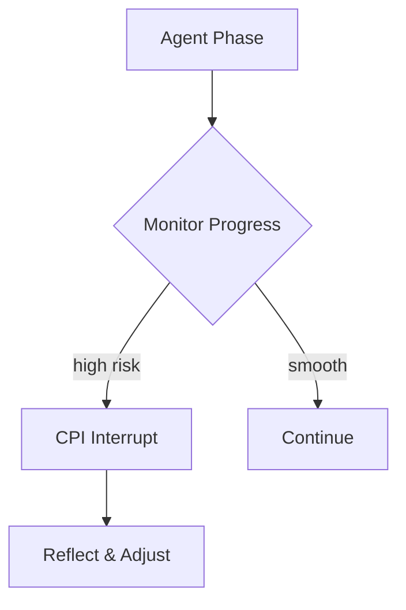

# Vibe Check MCP

<p align="center"><b>KISS overzealous agents goodbye. Plug & play agent oversight tool.</b></p>

<p align="center">
  <b>Based on research:</b><br/>
  In our study agents calling Vibe Check improved success +27% and halved harmful actions -41%
</p>

<p align="center">
  <a href="https://www.researchgate.net/publication/394946231_Do_AI_Agents_Need_Mentors_Evaluating_Chain-Pattern_Interrupt_CPI_for_Oversight_and_Reliability?channel=doi&linkId=68ad6178ca495d76982ff192&showFulltext=true">
    
  </a>
  <a href="https://github.com/modelcontextprotocol/servers"></a>
  <a href="https://registry.modelcontextprotocol.io/"></a>
  <a href="https://www.pulsemcp.com/servers/pv-bhat-vibe-check">
    
  </a>
  <a href="https://github.com/PV-Bhat/vibe-check-mcp-server/actions/workflows/ci.yml"></a>
  <a href="https://smithery.ai/server/@PV-Bhat/vibe-check-mcp-server"></a>
  <a href="LICENSE"></a>
</p>

<p align="center">
  <sub> Featured on PulseMCP “Most Popular (This Week)” • 5k+ monthly calls on Smithery.ai • research-backed oversight • STDIO + streamable HTTP transport</sub>
</p>


[](https://github.com/PV-Bhat/vibe-check-mcp-server)
[](https://archestra.ai/mcp-catalog/pv-bhat__vibe-check-mcp-server)
[](https://mseep.ai/app/a2954e62-a3f8-45b8-9a03-33add8b92599)
[](CONTRIBUTING.md)

*Plug-and-play mentor layer that stops agents from over-engineering and keeps them on the minimal viable path — research-backed MCP server keeping LLMs aligned, reflective and safe.*

<div align="center">
  <a href="https://github.com/PV-Bhat/vibe-check-mcp-server">
    
  </a>
  &nbsp;&nbsp;
  <a href="https://registry.modelcontextprotocol.io">
    
  </a>
  &nbsp;&nbsp;
  <a href="https://smithery.ai/server/@PV-Bhat/vibe-check-mcp-server">
    
  </a>
  &nbsp;&nbsp;
  <a href="https://www.pulsemcp.com/servers/pv-bhat-vibe-check">
    
  </a>
</div>

<div align="center">
  <em>Trusted by developers across MCP platforms and registries</em>
</div>

## Quickstart (npx)

Run the server directly from npm without a local installation. Requires Node **>=20**.

```bash
# Start the server with stdio transport
npx -y @pv-bhat/vibe-check-mcp start --stdio
```

For client integrations (like Claude Desktop or Cursor), add this entry to your MCP configuration:

```json
{
  "mcpServers": {
    "vibe-check-mcp": {
      "command": "npx",
      "args": ["-y", "@pv-bhat/vibe-check-mcp", "start", "--stdio"]
    }
  }
}
```

The server will be downloaded and run on-demand. For detailed client setup and other commands like `install` and `doctor`, see the full documentation below.

[](https://www.star-history.com/#PV-Bhat/vibe-check-mcp-server&Date)

### Recognition
- Featured on PulseMCP “Most Popular (This Week)” front page (week of 13 Oct 2025) [🔗](https://www.pulsemcp.com/servers/pv-bhat-vibe-check)
- Listed in Anthropic’s official Model Context Protocol repo [🔗](https://github.com/modelcontextprotocol/servers?tab=readme-overview#-community-servers)
- Discoverable in the official MCP Registry [🔗](https://registry.modelcontextprotocol.io/v0/servers?search=vibe-check-mcp)
- Featured on Sean Kochel's Top 9 MCP servers for vibe coders [🔗](https://youtu.be/2wYO6sdQ9xc?si=mlVo4iHf_hPKghxc&t=1331)

## Table of Contents
- [Quickstart (npx)](#quickstart-npx)
- [What is Vibe Check MCP?](#what-is-vibe-check-mcp)
- [Overview](#overview)
- [The Problem: Pattern Inertia & Reasoning Lock-In](#the-problem-pattern-inertia--reasoning-lock-in)
- [Key Features](#key-features)
- [What's New](#whats-new-in-v274)
- [Development Setup](#development-setup)
- [Release](#release)
- [Usage Examples](#usage-examples)
- [Adaptive Metacognitive Interrupts (CPI)](#adaptive-metacognitive-interrupts-cpi)
- [Agent Prompting Essentials](#agent-prompting-essentials)
- [When to Use Each Tool](#when-to-use-each-tool)
- [Documentation](#documentation)
- [Research & Philosophy](#research--philosophy)
- [Security](#security)
- [Roadmap](#roadmap)
- [Contributors & Community](#contributors--community)
- [FAQ](#faq)
- [Listed on](#find-vibe-check-mcp-on)
- [Credits & License](#credits--license)
---
## What is Vibe Check MCP?

Vibe Check MCP keeps agents on the minimal viable path and escalates complexity only when evidence demands it. Vibe Check MCP is a lightweight server implementing Anthropic's [Model Context Protocol](https://anthropic.com/mcp). It acts as an **AI meta-mentor** for your agents, interrupting pattern inertia with **Chain-Pattern Interrupts (CPI)** to prevent Reasoning Lock-In (RLI). Think of it as a rubber-duck debugger for LLMs – a quick sanity check before your agent goes down the wrong path.

## Overview

Vibe Check MCP pairs a metacognitive signal layer with CPI so agents can pause when risk spikes. Vibe Check surfaces traits, uncertainty, and risk scores; CPI consumes those triggers and enforces an intervention policy before the agent resumes. See the [CPI integration guide](./docs/integrations/cpi.md) and the CPI repo at https://github.com/PV-Bhat/cpi for wiring details.

Vibe Check invokes a second LLM to give meta-cognitive feedback to your main agent. Integrating vibe_check calls into agent system prompts and instructing tool calls before irreversible actions significantly improves agent alignment and common-sense. The high-level component map: [docs/architecture.md](./docs/architecture.md), while the CPI handoff diagram and example shim are captured in [docs/integrations/cpi.md](./docs/integrations/cpi.md).

## The Problem: Pattern Inertia & Reasoning Lock-In

Large language models can confidently follow flawed plans. Without an external nudge they may spiral into overengineering or misalignment. Vibe Check provides that nudge through short reflective pauses, improving reliability and safety.

## Key Features

| Feature | Description | Benefits |
|---------|-------------|----------|
| **CPI Adaptive Interrupts** | Phase-aware prompts that challenge assumptions | alignment, robustness |
| **Multi-provider LLM** | Gemini, OpenAI, Anthropic, and OpenRouter support | flexibility |
| **History Continuity** | Summarizes prior advice when `sessionId` is supplied | context retention |
| **Optional vibe_learn** | Log mistakes and fixes for future reflection | self-improvement |

## What's New in v2.7.4

- `install --client` now supports Cursor, Windsurf, and Visual Studio Code with idempotent merges, atomic writes, and `.bak` rollbacks.
- HTTP-aware installers preserve `serverUrl` entries for Windsurf and emit VS Code workspace snippets plus a `vscode:mcp/install` link when no config is provided.
- Documentation now consolidates provider keys, transport selection, uninstall guidance, and dedicated client docs at [docs/clients.md](./docs/clients.md).

## Session Constitution (per-session rules)

Use a lightweight “constitution” to enforce rules per `sessionId` that CPI will honor. Eg. constitution rules: “no external network calls,” “prefer unit tests before refactors,” “never write secrets to disk.”

**API (tools):**
- `update_constitution({ sessionId, rules })` → merges/sets rule set for the session
- `reset_constitution({ sessionId })` → clears session rules
- `check_constitution({ sessionId })` → returns effective rules for the session

## Development Setup
```bash
# Clone and install
git clone https://github.com/PV-Bhat/vibe-check-mcp-server.git
cd vibe-check-mcp-server
npm ci
npm run build
npm test
```
Use **npm** for all workflows (`npm ci`, `npm run build`, `npm test`). This project targets Node **>=20**.

Create a `.env` file with the API keys you plan to use:
```bash
# Gemini (default)
GEMINI_API_KEY=your_gemini_api_key
# Optional providers / Anthropic-compatible endpoints
OPENAI_API_KEY=your_openai_api_key
OPENROUTER_API_KEY=your_openrouter_api_key
ANTHROPIC_API_KEY=your_anthropic_api_key
ANTHROPIC_AUTH_TOKEN=your_proxy_bearer_token
ANTHROPIC_BASE_URL=https://api.anthropic.com
ANTHROPIC_VERSION=2023-06-01
# Optional overrides
# DEFAULT_LLM_PROVIDER accepts gemini | openai | openrouter | anthropic
DEFAULT_LLM_PROVIDER=gemini
DEFAULT_MODEL=gemini-2.5-pro
```

#### Configuration 

See [docs/TESTING.md]() for instructions on how to run tests.

### Docker
The repository includes a helper script for one-command setup.
```bash
bash scripts/docker-setup.sh
```
See [Automatic Docker Setup](./docs/docker-automation.md) for full details.

### Provider keys

See [API Keys & Secret Management](./docs/api-keys.md) for supported providers, resolution order, storage locations, and security guidance.

### Transport selection

The CLI supports stdio and HTTP transports. Transport resolution follows this order: explicit flags (`--stdio`/`--http`) → `MCP_TRANSPORT` → default `stdio`. When using HTTP, specify `--port` (or set `MCP_HTTP_PORT`); the default port is **2091**. The generated entries add `--stdio` or `--http --port <n>` accordingly, and HTTP-capable clients also receive a `http://127.0.0.1:<port>` endpoint.

### Client installers

Each installer is idempotent and tags entries with `"managedBy": "vibe-check-mcp-cli"`. Backups are written once per run before changes are applied, and merges are atomic (`*.bak` files make rollback easy). See [docs/clients.md](./docs/clients.md) for deeper client-specific references.

#### Claude Desktop

- Config path: `claude_desktop_config.json` (auto-discovered per platform).
- Default transport: stdio (`npx … start --stdio`).
- Restart Claude Desktop after installation to load the new MCP server.
- If an unmanaged entry already exists for `vibe-check-mcp`, the CLI leaves it untouched and prints a warning.

#### Cursor

- Config path: `~/.cursor/mcp.json` (provide `--config` if you store it elsewhere).
- Schema mirrors Claude’s `mcpServers` layout.
- If the file is missing, the CLI prints a ready-to-paste JSON block for Cursor’s settings panel instead of failing.

#### Windsurf (Cascade)

- Config path: legacy `~/.codeium/windsurf/mcp_config.json`, new builds use `~/.codeium/mcp_config.json`.
- Pass `--http` to emit an entry with `serverUrl` for Windsurf’s HTTP client.
- Existing sentinel-managed `serverUrl` entries are preserved and updated in place.

#### Visual Studio Code

- Workspace config lives at `.vscode/mcp.json`; profiles also store `mcp.json` in your VS Code user data directory.
- Provide `--config <path>` to target a workspace file. Without `--config`, the CLI prints a JSON snippet and a `vscode:mcp/install?...` link you can open directly from the terminal.
- VS Code supports optional dev fields; pass `--dev-watch` and/or `--dev-debug <value>` to populate `dev.watch`/`dev.debug`.

### Uninstall & rollback

- Restore the backup generated during installation (the newest `*.bak` next to your config) to revert immediately.
- To remove the server manually, delete the `vibe-check-mcp` entry under `mcpServers` (Claude/Windsurf/Cursor) or `servers` (VS Code) as long as it is still tagged with `"managedBy": "vibe-check-mcp-cli"`.

## Research & Philosophy

**CPI (Chain-Pattern Interrupt)** is the research-backed oversight method behind Vibe Check. It injects brief, well-timed “pause points” at risk inflection moments to re-align the agent to the user’s true priority, preventing destructive cascades and **reasoning lock-in (RLI)**. In pooled evaluation across 153 runs, CPI **nearly doubles success (~27%→54%) and roughly halves harmful actions (~83%→42%)**. Optimal interrupt **dosage is ~10–20%** of steps. *Vibe Check MCP implements CPI as an external mentor layer at test time.*

**Links:**  
- 📄 **CPI Paper (ResearchGate)** — http://dx.doi.org/10.13140/RG.2.2.18237.93922  
- 📘 **CPI Reference Implementation (GitHub)**: https://github.com/PV-Bhat/cpi
- 📚 **MURST Zenodo DOI (RSRC archival)**: https://doi.org/10.5281/zenodo.14851363



## Agent Prompting Essentials
In your agent's system prompt, make it clear that `vibe_check` is a mandatory tool for reflection. Always pass the full user request and other relevant context. After correcting a mistake, you can optionally log it with `vibe_learn` to build a history for future analysis.

Example snippet:
```
As an autonomous agent you will:
1. Call vibe_check after planning and before major actions.
2. Provide the full user request and your current plan.
3. Optionally, record resolved issues with vibe_learn.
```

## When to Use Each Tool
| Tool                   | Purpose                                                      |
|------------------------|--------------------------------------------------------------|
| 🛑 **vibe_check**       | Challenge assumptions and prevent tunnel vision              |
| 🔄 **vibe_learn**       | Capture mistakes, preferences, and successes                 |
| 🧰 **update_constitution** | Set/merge session rules the CPI layer will enforce         |
| 🧹 **reset_constitution**  | Clear rules for a session                                  |
| 🔎 **check_constitution**  | Inspect effective rules for a session                      |

## Documentation
- [Agent Prompting Strategies](./docs/agent-prompting.md)
- [CPI Integration](./docs/integrations/cpi.md)
- [Advanced Integration](./docs/advanced-integration.md)
- [Technical Reference](./docs/technical-reference.md)
- [Automatic Docker Setup](./docs/docker-automation.md)
- [Philosophy](./docs/philosophy.md)
- [Case Studies](./docs/case-studies.md)
- [Changelog](./docs/changelog.md)

## Security
This repository includes a CI-based security scan that runs on every pull request. It checks dependencies with `npm audit` and scans the source for risky patterns. See [SECURITY.md](./SECURITY.md) for details and how to report issues.

## Roadmap (New PRs welcome)

### Priority 1 – Builder Experience & Guidance
- **Structured output for `vibe_check`:** Return a JSON envelope such as `{ advice, riskScore, traits }` so downstream agents can reason deterministically while preserving readable reflections.
- **Agent prompt starter kit:** Publish a plug-and-play system prompt snippet that teaches the CPI dosage principle (10–20% of steps), calls out risk inflection points, and reminds agents to include the last 5–10 tool calls in `taskContext`.
- **Documentation refresh:** Highlight the new prompt template and context requirements throughout the README and integration guides.

### Priority 2 – Core Reliability Requests
- **LLM resilience:** Wrap `generateResponse` in `src/utils/llm.ts` with retries and exponential backoff, with a follow-up circuit breaker once the basics land.
- **Input sanitization:** Validate and cleanse tool arguments in `src/index.ts` to mitigate prompt-injection vectors.
- **State stewardship:** Add TTL-based cleanup in `src/utils/state.ts` and switch `src/utils/storage.ts` file writes to `fs.promises` to avoid blocking the event loop.

These initiatives are tracked as community-facing GitHub issues so contributors can grab them and see progress in the open.

### Additional Follow-On Ideas & Good First Issues
- **Telemetry sanity checks:** Add a lint-style CI step that verifies `docs/` examples compile (e.g., TypeScript snippet type-check) to catch drift between docs and code.
- **CLI help polish:** Ensure every CLI subcommand prints a concise `--help` example aligned with the refreshed prompt guidance.
- **Docs navigation cleanup:** Cross-link `docs/agent-prompting.md` and `docs/technical-reference.md` from the README section headers to reduce context switching for new contributors.

## Contributors & Community
Contributions are welcome! See [CONTRIBUTING.md](./CONTRIBUTING.md).

<a href="https://github.com/PV-Bhat/vibe-check-mcp-server/graphs/contributors">
  
</a> 

## Links
* [MSEEP](https://mseep.ai/app/pv-bhat-vibe-check-mcp-server)
* [MCP Servers](https://mcpservers.org/servers/PV-Bhat/vibe-check-mcp-server)
* [MCP.so](https://mcp.so/server/vibe-check-mcp-server/PV-Bhat)
* [Creati.ai](https://creati.ai/mcp/vibe-check-mcp-server/)
* [Pulse MCP](https://www.pulsemcp.com/servers/pv-bhat-vibe-check)
* [Playbooks.com](https://playbooks.com/mcp/pv-bhat-vibe-check)
* [MCPHub.tools](https://mcphub.tools/detail/PV-Bhat/vibe-check-mcp-server)
* [MCP Directory](https://mcpdirectory.ai/mcpserver/2419/)

## Credits & License
Vibe Check MCP is released under the [MIT License](LICENSE). Built for reliable, enterprise-ready AI agents.

## Author Credits & Links
Vibe Check MCP created by: [Pruthvi Bhat](https://pruthvibhat.com/), Initiative - https://murst.org/
