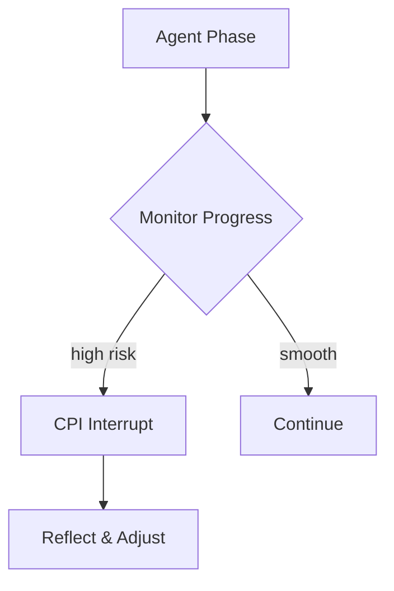

# 🧠 Vibe Check MCP v2.5.1

<p align="center">
  <b>Based on research</b><br/>
  In our study agents calling Vibe Check improved success (27 → 54%) and halved harmful actions (83 → 42%).
</p>

<p align="center">
  <a href="https://www.researchgate.net/publication/394946231_Do_AI_Agents_Need_Mentors_Evaluating_Chain-Pattern_Interrupt_CPI_for_Oversight_and_Reliability?channel=doi&linkId=68ad6178ca495d76982ff192&showFulltext=true">
    
  </a>
  <a href="https://github.com/modelcontextprotocol/servers"></a>
  <a href="https://registry.modelcontextprotocol.io/"></a>
  <a href="https://github.com/PV-Bhat/vibe-check-mcp-server/actions/workflows/ci.yml"></a>
  <a href="LICENSE"></a>
</p>

<p align="center">
  <sub>18k+ installs across MCP clients • research-backed oversight • streamable HTTP transport</sub>
</p>

*Plug-and-play metacognitive oversight layer for autonomous AI agents – a research-backed MCP server keeping LLMs aligned, reflective and safe.*


---

## 🚀 Quick Start: One-Liner Installation

Get up and running in seconds with the new NPX installer. No cloning, building, or manual configuration required.

```bash
npx vibe-check-mcp install
```

This single command downloads, installs, and configures the Vibe Check MCP server. It will guide you through setting up your API keys and prepare the server for immediate use with clients like Cursor IDE, Claude Desktop, and more.

---

### Recognition
- Listed in Anthropic's official Model Context Protocol repo [🔗](https://github.com/modelcontextprotocol/servers?tab=readme-ov-file#-community-servers)
- Discoverable in the official MCP Registry [🔗](https://registry.modelcontextprotocol.io/v0/servers?search=vibe-check-mcp)
- 18k+ installs across public MCP directories/clients


[](https://github.com/PV-Bhat/vibe-check-mcp-server)
[](https://archestra.ai/mcp-catalog/pv-bhat__vibe-check-mcp-server)
[](https://smithery.ai/server/@PV-Bhat/vibe-check-mcp-server)
[](https://mseep.ai/app/a2954e62-a3f8-45b8-9a03-33add8b92599)
[](CONTRIBUTING.md)

## Table of Contents
- [What is Vibe Check MCP?](#what-is-vibe-check-mcp)
- [Overview](#overview)
- [Architecture](#architecture)
- [The Problem: Pattern Inertia & Reasoning Lock-In](#the-problem-pattern-inertia--reasoning-lock-in)
- [Key Features](#key-features)
- [What's New in v2.5.1](#whats-new-in-v251)
- [Installation](#installation)
- [CLI Command Reference](#cli-command-reference)
- [Migrating from Manual Setup](#migrating-from-manual-setup)
- [Troubleshooting](#troubleshooting)
- [Usage Examples](#usage-examples)
- [Adaptive Metacognitive Interrupts (CPI)](#adaptive-metacognitive-interrupts-cpi)
- [Agent Prompting Essentials](#agent-prompting-essentials)
- [When to Use Each Tool](#when-to-use-each-tool)
- [Documentation](#documentation)
- [Research & Philosophy](#research--philosophy)
- [Security](#security)
- [Roadmap](#roadmap)
- [Contributing & Community](#contributing--community)
- [FAQ](#faq)
- [Listed on](#find-vibe-check-mcp-on)
- [Credits & License](#credits--license)

---

## What is Vibe Check MCP?

Vibe Check MCP is a lightweight server implementing Anthropic's [Model Context Protocol](https://anthropic.com/mcp). It acts as an **AI meta-mentor** for your agents, interrupting pattern inertia with **Chain-Pattern Interrupts (CPI)** to prevent Reasoning Lock-In (RLI). Think of it as a rubber-duck debugger for LLMs – a quick sanity check before your agent goes down the wrong path.

## Overview

Vibe Check MCP pairs a metacognitive signal layer with CPI so agents can pause when risk spikes. Vibe Check surfaces traits, uncertainty, and risk scores; CPI consumes those triggers and enforces an intervention policy before the agent resumes. See the [CPI integration guide](./docs/integrations/cpi.md) and the CPI repo at https://github.com/PV-Bhat/cpi for wiring details.

## Architecture

Vibe Check runs alongside your agent workflow, emitting signals that downstream overseers like CPI or human reviewers can act on. The high-level component map lives in [docs/architecture.md](./docs/architecture.md), while the CPI handoff diagram and example shim are captured in [docs/integrations/cpi.md](./docs/integrations/cpi.md).

## The Problem: Pattern Inertia & Reasoning Lock-In

Large language models can confidently follow flawed plans. Without an external nudge they may spiral into overengineering or misalignment. Vibe Check provides that nudge through short reflective pauses, improving reliability and safety.

## Key Features

| Feature | Description | Benefits |
|---------|-------------|----------|
| **CPI Adaptive Interrupts** | Phase-aware prompts that challenge assumptions | alignment, robustness |
| **Multi-provider LLM** | Gemini, OpenAI and OpenRouter support | flexibility |
| **History Continuity** | Summarizes prior advice when `sessionId` is supplied | context retention |
| **Optional vibe_learn** | Log mistakes and fixes for future reflection | self-improvement |

## What's New in v2.5.1

### Session Constitution (per-session rules)

Use a lightweight "constitution" to enforce rules per `sessionId` that CPI will honor. Typical uses: "no external network calls," "prefer unit tests before refactors," "never write secrets to disk."

**API (tools):**
- `update_constitution({ sessionId, rules })` → merges/sets rule set for the session
- `reset_constitution({ sessionId })` → clears session rules
- `check_constitution({ sessionId })` → returns effective rules for the session as a JSON string in text format for broad MCP client compatibility

**Response Format Note:** The `check_constitution` tool returns its data with `type: 'text'` containing a JSON string (rather than `type: 'json'`) to ensure compatibility with the widest range of MCP clients. Clients will need to parse the text field to access the JSON data.

## Installation

Choose the method that best fits your workflow. The NPX installer is recommended for most users.

### Method 1: NPX One-Liner (Recommended)
This is the simplest and fastest way to get started. It requires Node.js (v20+) and npm.

1.  **Run the installer:**
    ```bash
    npx vibe-check-mcp install
    ```
    The script will automatically handle downloading, setup, and dependency installation. It will prompt you for your preferred LLM provider and API key.

2.  **Start the server:**
    Once installed, you can start the server from any terminal window:
    ```bash
    vibe-check start
    ```

The installer adds the `vibe-check` command to your system's PATH, making it easy to manage the server. See the [CLI Command Reference](#cli-command-reference) for more commands.

### Method 2: Docker
The repository includes a helper script for a one-command Docker setup.

```bash
bash scripts/docker-setup.sh
```
This script builds the image, configures the container for auto-start, and prompts for your API key. See [Automatic Docker Setup](./docs/docker-automation.md) for full details.

For manual Docker commands:
```bash
docker build -t vibe-check-mcp .
docker run -e GEMINI_API_KEY=your_gemini_api_key -p 3000:3000 vibe-check-mcp
```

### Method 3: Manual from Source (Advanced)
This method is for developers who want to modify the source code.

1.  **Clone and install:**
    ```bash
    git clone https://github.com/PV-Bhat/vibe-check-mcp-server.git
    cd vibe-check-mcp-server
    npm install
    npm run build
    ```
    This project targets Node **20+**.

2.  **Configure environment:**
    Create a `.env` file with your API keys:
    ```bash
    # Gemini (default)
    GEMINI_API_KEY=your_gemini_api_key
    # Optional providers
    OPENAI_API_KEY=your_openai_api_key
    OPENROUTER_API_KEY=your_openrouter_api_key
    ```

3.  **Start the server:**
    ```bash
    npm start
    ```

## CLI Command Reference

The `npx` installer provides the `vibe-check` command-line tool to manage your installation.

| Command | Description | Options & Examples |
|---------|-------------|--------------------|
| `install` | Installs or updates the Vibe Check server. | `npx vibe-check-mcp install`<br>`--provider <name>` (e.g., `gemini`)<br>`--key <api_key>` (provide non-interactively)<br>`--path <dir>` (custom install directory) |
| `start` | Starts the Vibe Check server process. | `vibe-check start`<br>`--port <number>` (e.g., `3001`)<br>`--host <address>` (e.g., `0.0.0.0`) |
| `uninstall` | Removes the server and all configuration files. | `vibe-check uninstall`<br>`--force` (skip confirmation) |
| `doctor` | Checks the status and configuration of your installation. | `vibe-check doctor`<br>Verifies API keys, server status, and file paths. |

**Platform-Specific Notes:**
- **Windows:** The CLI works in both Command Prompt and PowerShell. Installation adds the command to your user's PATH. A terminal restart may be required.
- **macOS/Linux:** The installer adds a line to your `.zshrc`, `.bashrc`, or `.profile` to make the `vibe-check` command available. You may need to restart your terminal or run `source ~/.zshrc` for the change to take effect.

## Migrating from Manual Setup
If you previously installed Vibe Check by cloning the repository, you can easily switch to the CLI-managed version.

1.  **Stop the old server:** If it's running, stop the `npm start` process.
2.  **Run the installer:** Execute the `npx` command. The installer will detect your existing `.env` file and offer to migrate your API keys automatically.
    ```bash
    npx vibe-check-mcp install
    ```
3.  **Follow the prompts:** Confirm the migration. The new CLI-managed server will be installed.
4.  **Clean up (Optional):** Once you've confirmed the new setup works, you can safely delete the old `vibe-check-mcp-server` directory you cloned from Git.

The CLI provides backward compatibility and ensures a seamless transition.

## Troubleshooting

- **`vibe-check: command not found`**: After installation, you may need to restart your terminal for the new PATH to be recognized. If the issue persists, run `vibe-check doctor` to diagnose path issues.
- **`EACCES` or Permission Denied Errors**: On Linux/macOS, if the installer fails with permission errors, it may be because it cannot write to the default installation directory (`~/.vibe-check-mcp`). Try running the installer with a custom path you have write access to: `npx vibe-check-mcp install --path ./my-vibe-check`.
- **Port 3000 in use**: If `vibe-check start` fails because the port is busy, you can specify a different one: `vibe-check start --port 3001`.

## Usage Examples
```ts
import { vibe_check } from 'vibe-check-mcp';
const result = await vibe_check({
  goal: 'Write unit tests',
  plan: 'Use vitest for coverage',
  sessionId: 'demo1'
});
console.log(result.questions);
```


## Adaptive Metacognitive Interrupts (CPI)
<details><summary>Advanced CPI Details</summary>
The CPI architecture monitors planning, implementation and review phases. When uncertainty spikes, Vibe Check pauses execution, poses clarifying questions and resumes once the agent acknowledges the feedback.
</details>

## Agent Prompting Essentials
In your agent's system prompt, make it clear that `vibe_check` is a mandatory tool for reflection. Always pass the full user request and other relevant context. After correcting a mistake, you can optionally log it with `vibe_learn` to build a history for future analysis.

Example snippet:
```
As an autonomous agent you will:
1. Call vibe_check after planning and before major actions.
2. Provide the full user request and your current plan.
3. Optionally, record resolved issues with vibe_learn.
```

## When to Use Each Tool
| Tool                   | Purpose                                                      |
|------------------------|--------------------------------------------------------------|
| 🛑 **vibe_check**       | Challenge assumptions and prevent tunnel vision              |
| 🔄 **vibe_learn**       | Capture mistakes, preferences, and successes                 |
| 🧰 **update_constitution** | Set/merge session rules the CPI layer will enforce         |
| 🧹 **reset_constitution**  | Clear rules for a session                                  |
| 🔎 **check_constitution**  | Inspect effective rules for a session (returns JSON as text for MCP compatibility) |

## Documentation
- [CLI Command Reference](./docs/cli-reference.md)
- [Agent Prompting Strategies](./docs/agent-prompting.md)
- [CPI Integration](./docs/integrations/cpi.md)
- [Advanced Integration](./docs/advanced-integration.md)
- [Technical Reference](./docs/technical-reference.md)
- [Automatic Docker Setup](./docs/docker-automation.md)
- [Philosophy](./docs/philosophy.md)
- [Case Studies](./docs/case-studies.md)
- [Changelog](./docs/changelog.md)

## Research & Philosophy

**CPI (Chain-Pattern Interrupt)** is the research-backed oversight method behind Vibe Check. It injects brief, well-timed "pause points" at risk inflection moments to re-align the agent to the user's true priority, preventing destructive cascades and **reasoning lock-in (RLI)**. In pooled evaluation across 153 runs, CPI **nearly doubles success (~27%→54%) and roughly halves harmful actions (~83%→42%)**. Optimal interrupt **dosage is ~10–20%** of steps. *Vibe Check MCP implements CPI as an external mentor layer at test time.*

**Links:**
- 📄 **CPI Paper (ResearchGate)** — http://dx.doi.org/10.13140/RG.2.2.18237.93922
- 📘 **CPI Reference Implementation (GitHub)**: https://github.com/PV-Bhat/cpi
- 📚 **MURST Zenodo DOI (RSRC archival)**: https://doi.org/10.5281/zenodo.14851363

## Security
This repository includes a CI-based security scan that runs on every pull request. It checks dependencies with `npm audit` and scans the source for risky patterns. See [SECURITY.md](./SECURITY.md) for details and how to report issues.

## Roadmap
1. Benchmarks and latency profiling
2. Adaptive tuning based on agent performance
3. Multi-agent cooperation support
4. Optional human-in-the-loop review

## Contributing & Community
Contributions are welcome! See [CONTRIBUTING.md](./CONTRIBUTING.md).

## FAQ
- **Does it increase latency?** A single CPI call typically adds ~1 second depending on the provider.
- **Can I disable logging?** Yes, `vibe_learn` is optional.

## Find Vibe Check MCP on
* 🌐 [MSEEP](https://mseep.ai/app/pv-bhat-vibe-check-mcp-server)
* 📡 [MCP Servers](https://mcpservers.org/servers/PV-Bhat/vibe-check-mcp-server)
* 🧠 [MCP.so](https://mcp.so/server/vibe-check-mcp-server/PV-Bhat)
* 🛠️ [Creati.ai](https://creati.ai/mcp/vibe-check-mcp-server/)
* 💡 [Pulse MCP](https://www.pulsemcp.com/servers/pv-bhat-vibe-check)
* 📘 [Playbooks.com](https://playbooks.com/mcp/pv-bhat-vibe-check)
* 🧰 [MCPHub.tools](https://mcphub.tools/detail/PV-Bhat/vibe-check-mcp-server)
* 📇 [MCP Directory](https://mcpdirectory.ai/mcpserver/2419/)
* 🧙 [MagicSlides](https://www.magicslides.app/mcps/pv-bhat-vibe-check)
* 🗃️ [AIAgentsList](https://aiagentslist.com/mcp-servers/vibe-check-mcp-server)

## Star History

[](https://star-history.com/#PV-Bhat/vibe-check-mcp-server&Date)

## Credits & License
Vibe Check MCP is released under the [MIT License](LICENSE). Built for reliable, enterprise-ready AI agents.

## Author Credits & Links
Vibe Check MCP created by: [Pruthvi Bhat](https://pruthvibhat.com/), Intiative - https://murst.org/