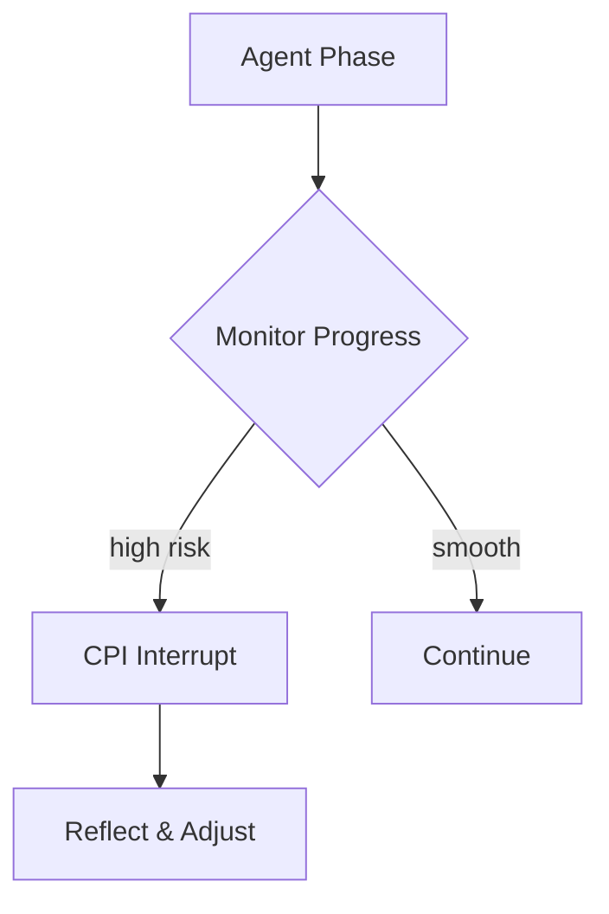

# 🧠 Vibe Check MCP v2.5.1

<p align="center">
  <b>Based on research</b><br/>
  In our study agents calling Vibe Check improved success (27 → 54%) and halved harmful actions (83 → 42%).
</p>

<p align="center">
  <a href="https://www.researchgate.net/publication/394946231_Do_AI_Agents_Need_Mentors_Evaluating_Chain-Pattern_Interrupt_CPI_for_Oversight_and_Reliability?channel=doi&linkId=68ad6178ca495d76982ff192&showFulltext=true">
    
  </a>
  <a href="https://github.com/modelcontextprotocol/servers"></a>
  <a href="https://registry.modelcontextprotocol.io/"></a>
  <a href="https://github.com/PV-Bhat/vibe-check-mcp-server/actions/workflows/ci.yml"></a>
  <a href="LICENSE"></a>
</p>

<p align="center">
  <sub>28k+ installs PulseMCP & 2k+ Monthly calls Smithery.ai • research-backed oversight • streamable HTTP transport</sub>
</p>


*Plug-and-play metacognitive oversight layer for autonomous AI agents – a research-backed MCP server keeping LLMs aligned, reflective and safe.*

## Quickstart (npx)

```bash
npx @pv-bhat/vibe-check-mcp start --stdio

# Or HTTP mode
npx @pv-bhat/vibe-check-mcp start --http --port 2091

# Basic diagnostics
npx @pv-bhat/vibe-check-mcp doctor
```

Requires Node **>=20**. These commands install straight from npm, build the CLI on demand, and work on any machine with `npx`.

### Recognition
- Listed in Anthropic’s official Model Context Protocol repo [🔗](https://github.com/modelcontextprotocol/servers?tab=readme-ov-file#-community-servers)
- Discoverable in the official MCP Registry [🔗](https://registry.modelcontextprotocol.io/v0/servers?search=vibe-check-mcp)
- 30k+ installs total across public MCP directories/clients 


[](https://github.com/PV-Bhat/vibe-check-mcp-server)
[](https://archestra.ai/mcp-catalog/pv-bhat__vibe-check-mcp-server)
[](https://smithery.ai/server/@PV-Bhat/vibe-check-mcp-server)
[](https://mseep.ai/app/a2954e62-a3f8-45b8-9a03-33add8b92599)
[](CONTRIBUTING.md)

## Table of Contents
- [Quickstart (npx)](#quickstart-npx)
- [What is Vibe Check MCP?](#what-is-vibe-check-mcp)
- [Overview](#overview)
- [Architecture](#architecture)
- [The Problem: Pattern Inertia & Reasoning Lock-In](#the-problem-pattern-inertia--reasoning-lock-in)
- [Key Features](#key-features)
- [What's New in v2.5.1](#whats-new-in-v251)
- [Quickstart & Installation](#quickstart--installation)
- [Release](#release)
- [Usage Examples](#usage-examples)
- [Adaptive Metacognitive Interrupts (CPI)](#adaptive-metacognitive-interrupts-cpi)
- [Agent Prompting Essentials](#agent-prompting-essentials)
- [When to Use Each Tool](#when-to-use-each-tool)
- [Documentation](#documentation)
- [Research & Philosophy](#research--philosophy)
- [Security](#security)
- [Roadmap](#roadmap)
- [Contributing & Community](#contributing--community)
- [FAQ](#faq)
- [Listed on](#find-vibe-check-mcp-on)
- [Credits & License](#credits--license)
---
## What is Vibe Check MCP?

Vibe Check MCP is a lightweight server implementing Anthropic's [Model Context Protocol](https://anthropic.com/mcp). It acts as an **AI meta-mentor** for your agents, interrupting pattern inertia with **Chain-Pattern Interrupts (CPI)** to prevent Reasoning Lock-In (RLI). Think of it as a rubber-duck debugger for LLMs – a quick sanity check before your agent goes down the wrong path.

## Overview

Vibe Check MCP pairs a metacognitive signal layer with CPI so agents can pause when risk spikes. Vibe Check surfaces traits, uncertainty, and risk scores; CPI consumes those triggers and enforces an intervention policy before the agent resumes. See the [CPI integration guide](./docs/integrations/cpi.md) and the CPI repo at https://github.com/PV-Bhat/cpi for wiring details.

## Architecture

Vibe Check runs alongside your agent workflow, emitting signals that downstream overseers like CPI or human reviewers can act on. The high-level component map lives in [docs/architecture.md](./docs/architecture.md), while the CPI handoff diagram and example shim are captured in [docs/integrations/cpi.md](./docs/integrations/cpi.md).

## The Problem: Pattern Inertia & Reasoning Lock-In

Large language models can confidently follow flawed plans. Without an external nudge they may spiral into overengineering or misalignment. Vibe Check provides that nudge through short reflective pauses, improving reliability and safety.

## Key Features

| Feature | Description | Benefits |
|---------|-------------|----------|
| **CPI Adaptive Interrupts** | Phase-aware prompts that challenge assumptions | alignment, robustness |
| **Multi-provider LLM** | Gemini, OpenAI and OpenRouter support | flexibility |
| **History Continuity** | Summarizes prior advice when `sessionId` is supplied | context retention |
| **Optional vibe_learn** | Log mistakes and fixes for future reflection | self-improvement |

## What's New in v2.5.1

## Session Constitution (per-session rules)

Use a lightweight “constitution” to enforce rules per `sessionId` that CPI will honor. Typical uses: “no external network calls,” “prefer unit tests before refactors,” “never write secrets to disk.”

**API (tools):**
- `update_constitution({ sessionId, rules })` → merges/sets rule set for the session
- `reset_constitution({ sessionId })` → clears session rules
- `check_constitution({ sessionId })` → returns effective rules for the session

## Quickstart & Installation
```bash
# Clone and install
git clone https://github.com/PV-Bhat/vibe-check-mcp-server.git
cd vibe-check-mcp-server
npm ci
npm run build
npm test
```
Use **npm** for all workflows (`npm ci`, `npm run build`, `npm test`). This project targets Node **>=20**. If you see a TypeScript error about a duplicate `require` declaration when building with Node 20.19.3, ensure your dependencies are up to date (`npm ci`) or use the Docker setup below which handles the build automatically.

Create a `.env` file with the API keys you plan to use:
```bash
# Gemini (default)
GEMINI_API_KEY=your_gemini_api_key
# Optional providers
OPENAI_API_KEY=your_openai_api_key
OPENROUTER_API_KEY=your_openrouter_api_key
# Optional overrides
DEFAULT_LLM_PROVIDER=gemini
DEFAULT_MODEL=gemini-2.5-pro
```
Start the server:
```bash
npm start
```
See [docs/TESTING.md](./docs/TESTING.md) for instructions on how to run tests.

### Docker
The repository includes a helper script for one-command setup. It builds the image, saves your `GEMINI_API_KEY` and configures the container to start automatically whenever you log in:
```bash
bash scripts/docker-setup.sh
```
This script:
- Creates `~/vibe-check-mcp` for persistent data
- Builds the Docker image and sets up `docker-compose.yml`
- Prompts for your API key and writes `~/vibe-check-mcp/.env`
- Installs a systemd service (Linux) or LaunchAgent (macOS) so the container starts at login
- Generates `vibe-check-tcp-wrapper.sh` which proxies Cursor IDE to the server
After running it, open Cursor IDE → **Settings** → **MCP** and add a new server of type **Command** pointing to:
```bash
~/vibe-check-mcp/vibe-check-tcp-wrapper.sh
```
See [Automatic Docker Setup](./docs/docker-automation.md) for full details.
If you prefer to run the commands manually:
```bash
docker build -t vibe-check-mcp .
docker run -e GEMINI_API_KEY=your_gemini_api_key -p 3000:3000 vibe-check-mcp
```

## Release

Cut a new version by tagging the repository with [semantic versioning](https://semver.org/) (e.g., `v2.6.0`). The release workflow will:

1. build the project with Node 20 via `npm ci` and `npm run build`,
2. enforce coverage with `npm run test:coverage`,
3. run CLI smoke checks (`doctor`, `start --stdio --dry-run`, `start --http --port 2091 --dry-run`),
4. publish the package to npmjs using the `NPM_TOKEN` repository secret, and
5. verify the published tarball by running `npx @pv-bhat/vibe-check-mcp@<version> --help` on the freshly released build.

Ensure `NPM_TOKEN` is configured under **Repository Settings → Secrets and variables → Actions** before tagging.

### Install (Claude Desktop)

Register Vibe Check as a **local MCP server** inside Claude Desktop with the packaged CLI:

```bash
npx @pv-bhat/vibe-check-mcp install --client claude
```

For CI or other unattended environments, provide a provider API key up front and disable prompts:

```bash
ANTHROPIC_API_KEY=your_anthropic_api_key \
  npx @pv-bhat/vibe-check-mcp install --client claude --non-interactive
```

Set whichever key matches your provider — `ANTHROPIC_API_KEY`, `OPENAI_API_KEY`, `GEMINI_API_KEY`, or `OPENROUTER_API_KEY`. The installer requires at least one of these when running with `--non-interactive`.

The installer discovers your `claude_desktop_config.json`, creates a timestamped backup, and merges an entry under `mcpServers.vibe-check-mcp` that launches `npx @pv-bhat/vibe-check-mcp start --stdio`. Entries tagged with `"managedBy": "vibe-check-mcp-cli"` are updated in place on subsequent runs, keeping other servers intact.

Secrets default to `~/.vibe-check/.env`; pass `--local` to write to the current project's `.env`. Values are resolved in this order: shell environment → project `.env` → home config. Files are written atomically with `0600` permissions.

> ℹ️ Claude's desktop app uses the [Model Context Protocol](https://docs.anthropic.com/en/docs/claude-desktop/model-context-protocol) for local stdio servers. Remote HTTP connectors should still be added through Claude's UI as documented in the [Claude support guide](https://support.anthropic.com/en/articles/9492100-connect-apis-and-tools-to-claude-desktop).

## Research & Philosophy

**CPI (Chain-Pattern Interrupt)** is the research-backed oversight method behind Vibe Check. It injects brief, well-timed “pause points” at risk inflection moments to re-align the agent to the user’s true priority, preventing destructive cascades and **reasoning lock-in (RLI)**. In pooled evaluation across 153 runs, CPI **nearly doubles success (~27%→54%) and roughly halves harmful actions (~83%→42%)**. Optimal interrupt **dosage is ~10–20%** of steps. *Vibe Check MCP implements CPI as an external mentor layer at test time.*

**Links:**  
- 📄 **CPI Paper (ResearchGate)** — http://dx.doi.org/10.13140/RG.2.2.18237.93922  
- 📘 **CPI Reference Implementation (GitHub)**: https://github.com/PV-Bhat/cpi
- 📚 **MURST Zenodo DOI (RSRC archival)**: https://doi.org/10.5281/zenodo.14851363

## Usage Examples
```ts
import { vibe_check } from 'vibe-check-mcp';
const result = await vibe_check({
  goal: 'Write unit tests',
  plan: 'Use vitest for coverage',
  sessionId: 'demo1'
});
console.log(result.questions);
```


## Adaptive Metacognitive Interrupts (CPI)
<details><summary>Advanced CPI Details</summary>
The CPI architecture monitors planning, implementation and review phases. When uncertainty spikes, Vibe Check pauses execution, poses clarifying questions and resumes once the agent acknowledges the feedback.
</details>

## Agent Prompting Essentials
In your agent's system prompt, make it clear that `vibe_check` is a mandatory tool for reflection. Always pass the full user request and other relevant context. After correcting a mistake, you can optionally log it with `vibe_learn` to build a history for future analysis.

Example snippet:
```
As an autonomous agent you will:
1. Call vibe_check after planning and before major actions.
2. Provide the full user request and your current plan.
3. Optionally, record resolved issues with vibe_learn.
```

## When to Use Each Tool
| Tool                   | Purpose                                                      |
|------------------------|--------------------------------------------------------------|
| 🛑 **vibe_check**       | Challenge assumptions and prevent tunnel vision              |
| 🔄 **vibe_learn**       | Capture mistakes, preferences, and successes                 |
| 🧰 **update_constitution** | Set/merge session rules the CPI layer will enforce         |
| 🧹 **reset_constitution**  | Clear rules for a session                                  |
| 🔎 **check_constitution**  | Inspect effective rules for a session                      |

## Documentation
- [Agent Prompting Strategies](./docs/agent-prompting.md)
- [CPI Integration](./docs/integrations/cpi.md)
- [Advanced Integration](./docs/advanced-integration.md)
- [Technical Reference](./docs/technical-reference.md)
- [Automatic Docker Setup](./docs/docker-automation.md)
- [Philosophy](./docs/philosophy.md)
- [Case Studies](./docs/case-studies.md)
- [Changelog](./docs/changelog.md)

## Security
This repository includes a CI-based security scan that runs on every pull request. It checks dependencies with `npm audit` and scans the source for risky patterns. See [SECURITY.md](./SECURITY.md) for details and how to report issues.

## Roadmap
1. Benchmarks and latency profiling
2. Adaptive tuning based on agent performance
3. Multi-agent cooperation support
4. Optional human-in-the-loop review

## Contributing & Community
Contributions are welcome! See [CONTRIBUTING.md](./CONTRIBUTING.md).

## FAQ
- **Does it increase latency?** A single CPI call typically adds ~1 second depending on the provider.
- **Can I disable logging?** Yes, `vibe_learn` is optional.

## Find Vibe Check MCP on
* 🌐 [MSEEP](https://mseep.ai/app/pv-bhat-vibe-check-mcp-server)
* 📡 [MCP Servers](https://mcpservers.org/servers/PV-Bhat/vibe-check-mcp-server)
* 🧠 [MCP.so](https://mcp.so/server/vibe-check-mcp-server/PV-Bhat)
* 🛠️ [Creati.ai](https://creati.ai/mcp/vibe-check-mcp-server/)
* 💡 [Pulse MCP](https://www.pulsemcp.com/servers/pv-bhat-vibe-check)
* 📘 [Playbooks.com](https://playbooks.com/mcp/pv-bhat-vibe-check)
* 🧰 [MCPHub.tools](https://mcphub.tools/detail/PV-Bhat/vibe-check-mcp-server)
* 📇 [MCP Directory](https://mcpdirectory.ai/mcpserver/2419/)
* 🧙 [MagicSlides](https://www.magicslides.app/mcps/pv-bhat-vibe-check)
* 🗃️ [AIAgentsList](https://aiagentslist.com/mcp-servers/vibe-check-mcp-server)

## Star History

[](https://www.star-history.com/#PV-Bhat/vibe-check-mcp-server&Date)

## Credits & License
Vibe Check MCP is released under the [MIT License](LICENSE). Built for reliable, enterprise-ready AI agents.

## Author Credits & Links
Vibe Check MCP created by: [Pruthvi Bhat](https://pruthvibhat.com/), Intiative - https://murst.org/
