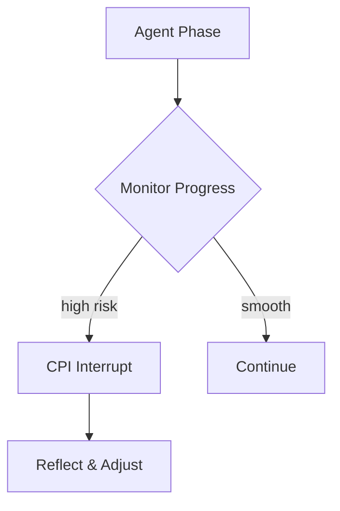

# 🧠 VibeCheck MCP v2.2


*Adaptive metacognitive oversight for autonomous AI agents – a research-backed MCP server keeping LLMs aligned, reflective and safe.*

## The Most Widely-Deployed Feedback Layer in the MCP Ecosystem
> ~10k+ downloads on PulseMCP and counting.
> Over 1k monthly tool calls via Smithery.
> Listed on 12+ orchestration platforms.
> Security rating 4.3 on MSEEP.ai.

[](https://github.com/PV-Bhat/vibe-check-mcp-server)
[](LICENSE)
[](https://github.com/PV-Bhat/vibe-check-mcp-server/actions/workflows/ci.yml)
[](https://github.com/PV-Bhat/vibe-check-mcp-server)
[](https://smithery.ai/server/@PV-Bhat/vibe-check-mcp-server)
[](https://mseep.ai/app/a2954e62-a3f8-45b8-9a03-33add8b92599)
[](CONTRIBUTING.md)

## Table of Contents
- [What is VibeCheck MCP?](#what-is-vibecheck-mcp)
- [The Problem: Pattern Inertia & Reasoning Lock-In](#the-problem-pattern-inertia--reasoning-lock-in)
- [Key Features](#key-features)
- [What's New in v2.2](#whats-new-in-v22)
- [Quickstart & Installation](#quickstart--installation)
- [Usage Examples](#usage-examples)
- [Adaptive Metacognitive Interrupts (CPI)](#adaptive-metacognitive-interrupts-cpi)
- [Agent Prompting Essentials](#agent-prompting-essentials)
- [When to Use Each Tool](#when-to-use-each-tool)
- [Documentation](#documentation)
- [Research & Philosophy](#research--philosophy)
- [Security](#security)
- [Roadmap](#roadmap)
- [Contributing & Community](#contributing--community)
- [FAQ](#faq)
- [Find VibeCheck MCP on](#find-vibecheck-mcp-on)
- [Credits & License](#credits--license)

---

## What is VibeCheck MCP?

VibeCheck MCP is a lightweight server implementing Anthropic's [Model Context Protocol](https://anthropic.com/mcp). It acts as an **AI meta-mentor** for your agents, interrupting pattern inertia with **Critical Path Interrupts (CPI)** to prevent Reasoning Lock-In (RLI). Think of it as a rubber-duck debugger for LLMs – a quick sanity check before your agent goes down the wrong path.

## The Problem: Pattern Inertia & Reasoning Lock-In

Large language models can confidently follow flawed plans. Without an external nudge they may spiral into overengineering or misalignment. VibeCheck provides that nudge through short reflective pauses, improving reliability and safety.

## Key Features

| Feature | Description | Benefits |
|---------|-------------|----------|
| **CPI Adaptive Interrupts** | Phase-aware prompts that challenge assumptions | alignment, robustness |
| **Multi-provider LLM** | Gemini, OpenAI and OpenRouter support | flexibility |
| **History Continuity** | Summarizes prior advice when `sessionId` is supplied | context retention |
| **Optional vibe_learn** | Log mistakes and fixes for future reflection | self-improvement |

## What's New in v2.2
- CPI-driven adaptive interrupts for smarter interventions
- Multi-provider routing (Gemini, OpenAI, OpenRouter)
- Optional `vibe_learn` logging
- History continuity across sessions

## Quickstart & Installation
```bash
# Clone and install
git clone https://github.com/PV-Bhat/vibe-check-mcp-server.git
cd vibe-check-mcp-server
npm install
npm run build
```
This project targets Node **20+**. If you see a TypeScript error about a duplicate `require` declaration when building with Node 20.19.3, ensure your dependencies are up to date (`npm install`) or use the Docker setup below which handles the build automatically.

Create a `.env` file with the API keys you plan to use:
```bash
# Gemini (default)
GEMINI_API_KEY=your_gemini_api_key
# Optional providers
OPENAI_API_KEY=your_openai_api_key
OPENROUTER_API_KEY=your_openrouter_api_key
# Optional overrides
DEFAULT_LLM_PROVIDER=gemini
DEFAULT_MODEL=gemini-2.5-pro
```
Start the server:
```bash
npm start
```
See [docs/TESTING.md](./docs/TESTING.md) for instructions on how to run tests.

### Docker
The repository includes a helper script for one-command setup. It builds the image, saves your `GEMINI_API_KEY` and configures the container to start automatically whenever you log in:
```bash
bash scripts/docker-setup.sh
```
This script:
- Creates `~/vibe-check-mcp` for persistent data
- Builds the Docker image and sets up `docker-compose.yml`
- Prompts for your API key and writes `~/vibe-check-mcp/.env`
- Installs a systemd service (Linux) or LaunchAgent (macOS) so the container starts at login
- Generates `vibe-check-tcp-wrapper.sh` which proxies Cursor IDE to the server
After running it, open Cursor IDE → **Settings** → **MCP** and add a new server of type **Command** pointing to:
```bash
~/vibe-check-mcp/vibe-check-tcp-wrapper.sh
```
See [Automatic Docker Setup](./docs/docker-automation.md) for full details.
If you prefer to run the commands manually:
```bash
docker build -t vibe-check-mcp .
docker run -e GEMINI_API_KEY=your_gemini_api_key -p 3000:3000 vibe-check-mcp
```

### Integrating with Claude Desktop
Add to `claude_desktop_config.json`:
```json
"vibe-check": {
  "command": "node",
  "args": ["/path/to/vibe-check-mcp/build/index.js"],
  "env": { "GEMINI_API_KEY": "YOUR_GEMINI_API_KEY" }
}
```

## Usage Examples
```ts
import { vibe_check } from 'vibe-check-mcp';
const result = await vibe_check({
  goal: 'Write unit tests',
  plan: 'Use vitest for coverage',
  sessionId: 'demo1'
});
console.log(result.questions);
```


## Adaptive Metacognitive Interrupts (CPI)
<details><summary>Advanced CPI Details</summary>
The CPI architecture monitors planning, implementation and review phases. When uncertainty spikes, VibeCheck pauses execution, poses clarifying questions and resumes once the agent acknowledges the feedback.
</details>

## Agent Prompting Essentials
In your agent's system prompt, make it clear that `vibe_check` is a mandatory tool for reflection. Always pass the full user request and other relevant context. After correcting a mistake, you can optionally log it with `vibe_learn` to build a history for future analysis.

Example snippet:
```
As an autonomous agent you will:
1. Call vibe_check after planning and before major actions.
2. Provide the full user request and your current plan.
3. Optionally, record resolved issues with vibe_learn.
```

## When to Use Each Tool
| Tool | Purpose |
|------|---------|
| 🛑 **vibe_check** | Challenge assumptions and prevent tunnel vision |
| 🔄 **vibe_learn** | Capture mistakes, preferences and successes |

## Documentation
- [Agent Prompting Strategies](./docs/agent-prompting.md)
- [Advanced Integration](./docs/advanced-integration.md)
- [Technical Reference](./docs/technical-reference.md)
- [Automatic Docker Setup](./docs/docker-automation.md)
- [Philosophy](./docs/philosophy.md)
- [Case Studies](./docs/case-studies.md)
- [Changelog](./docs/changelog.md)

## Research & Philosophy
See [docs/philosophy.md](./docs/philosophy.md) for the alignment research behind VibeCheck. The approach draws inspiration from Reflexion, Constitutional AI and other high-trust frameworks.

## Security
This repository includes a CI-based security scan that runs on every pull request. It checks dependencies with `npm audit` and scans the source for risky patterns. See [SECURITY.md](./SECURITY.md) for details and how to report issues.

## Roadmap
1. Benchmarks and latency profiling
2. Adaptive tuning based on agent performance
3. Multi-agent cooperation support
4. Optional human-in-the-loop review

## Contributing & Community
Contributions are welcome! See [CONTRIBUTING.md](./CONTRIBUTING.md) and join our Discord for discussion.

## FAQ
- **Does it increase latency?** A single CPI call typically adds ~1 second depending on the provider.
- **Can I disable logging?** Yes, `vibe_learn` is optional.

## Find VibeCheck MCP on
* 🌐 [MSEEP](https://mseep.ai/app/pv-bhat-vibe-check-mcp-server)
* 📡 [MCP Servers](https://mcpservers.org/servers/PV-Bhat/vibe-check-mcp-server)
* 🧠 [MCP.so](https://mcp.so/server/vibe-check-mcp-server/PV-Bhat)
* 🛠️ [Creati.ai](https://creati.ai/mcp/vibe-check-mcp-server/)
* 💡 [Pulse MCP](https://www.pulsemcp.com/servers/pv-bhat-vibe-check)
* 📘 [Playbooks.com](https://playbooks.com/mcp/pv-bhat-vibe-check)
* 🧰 [MCPHub.tools](https://mcphub.tools/detail/PV-Bhat/vibe-check-mcp-server)
* 📇 [MCP Directory](https://mcpdirectory.ai/mcpserver/2419/)
* 🧙 [MagicSlides](https://www.magicslides.app/mcps/pv-bhat-vibe-check)
* 🗃️ [AIAgentsList](https://aiagentslist.com/mcp-servers/vibe-check-mcp-server)

## Credits & License
VibeCheck MCP is released under the [MIT License](LICENSE). Built for reliable, enterprise-ready AI agents.
