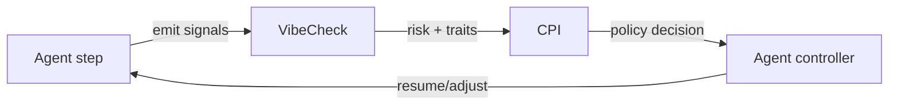

# CPI Integration

## Overview
> CPI (Chain-Pattern Interrupt): a runtime oversight mechanism for multi-agent systems that mitigates “reasoning lock-in.” It injects interrupts based on policy triggers (pattern detectors, heuristics, or external signals), then resumes or reroutes flow.
>
> Core pieces: (1) trigger evaluators, (2) intervention policy (allow/block/route/ask-human), (3) logging & repro harness.
>
> Status: repo includes repro evals; “constitution” tool supports per-session rule-sets.
>
> Integration intent with VibeCheck: VibeCheck = metacognitive layer (signals/traits/uncertainty). CPI = on-policy interrupter. VibeCheck feeds CPI triggers; CPI acts on them.

CPI composes with VibeCheck by acting as an on-policy interrupter whenever VibeCheck signals a risk spike. Use VibeCheck to surface agent traits, uncertainty, and risk levels, then forward that context to CPI so its policy engine can decide whether to allow, block, reroute, or escalate the next action. The example stub in [`examples/cpi-integration.ts`](../../examples/cpi-integration.ts) illustrates the plumbing you can copy into your own orchestrator.

## Flow diagram


## Minimal integration sketch
Below is a minimal TypeScript sketch that mirrors the logic in the [`runWithCPI`](../../examples/cpi-integration.ts) example. Replace the TODO markers with the real CPI SDK import when it becomes available.

```ts
type AgentStep = {
  sessionId: string;
  summary: string;
  nextAction: string;
};

type VibeCheckSignal = {
  riskScore: number;
  advice: string;
};

async function analyzeWithVibeCheck(step: AgentStep): Promise<VibeCheckSignal> {
  // TODO: replace with a real call to the VibeCheck MCP server.
  return { riskScore: Math.random(), advice: `Reflect on: ${step.summary}` };
}

// TODO: replace with `import { createPolicy } from '@cpi/sdk';`
function cpiPolicyShim(signal: VibeCheckSignal) {
  if (signal.riskScore >= 0.6) {
    return { action: 'interrupt', reason: 'High metacognitive risk from VibeCheck' } as const;
  }
  return { action: 'allow' } as const;
}

export async function evaluateStep(step: AgentStep) {
  const signal = await analyzeWithVibeCheck(step);
  const decision = cpiPolicyShim(signal);

  if (decision.action === 'interrupt') {
    // Pause your agent, collect clarification, or reroute to a human.
    return { status: 'paused', reason: decision.reason } as const;
  }

  return { status: 'continue', signal } as const;
}
```

### Implementation checklist
1. Surface VibeCheck scores (risk, traits, uncertainty) alongside the raw advice payload.
2. Normalize those signals into CPI trigger events (e.g., `riskScore > 0.6`).
3. Hand the event to a CPI intervention policy and respect the returned directive.
4. Feed decisions into the CPI logging & repro harness to preserve traces.

## Further reading
- CPI reference implementation (placeholder): <https://github.com/<ORG>/cpi>
- VibeCheck + CPI wiring example: [`examples/cpi-integration.ts`](../../examples/cpi-integration.ts)
